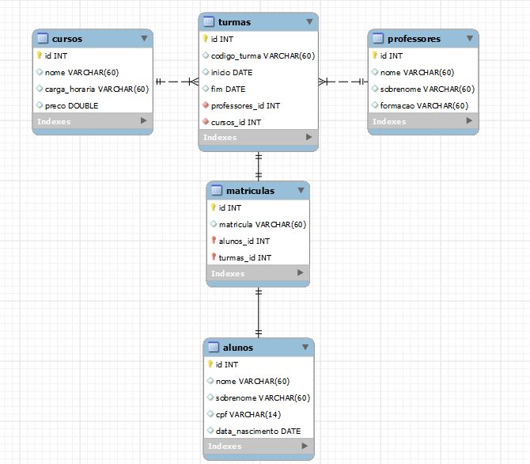

## Trabalho individual do quarto módulo.

### Existem outras entidades além dessas três?
Sim, as entidades dos professores para manter um controle sobre quais professores são responsaveis para determinada turma, e uma entidade para as matrículas para assim poder fazer as relações entre as tabelas mais completas.

### Quais são os principais campos e tipos?
Os principais campos foram nomes, codigos de turma, matrículas e foram utilazados os tipos como INT, VARCHAR DOUBLE, PRIMARY E FOREIGN KEYS.

### Como essas entidades estão relacionadas?
As tabelas de cursos e professores tem relação de um para muitos com a tabela de turmas, já a tabela matrículas tem relacionamento de um para um com a tabelas turmas assim como a tabelas alunos com matrículas.

### Diagrama do banco.

